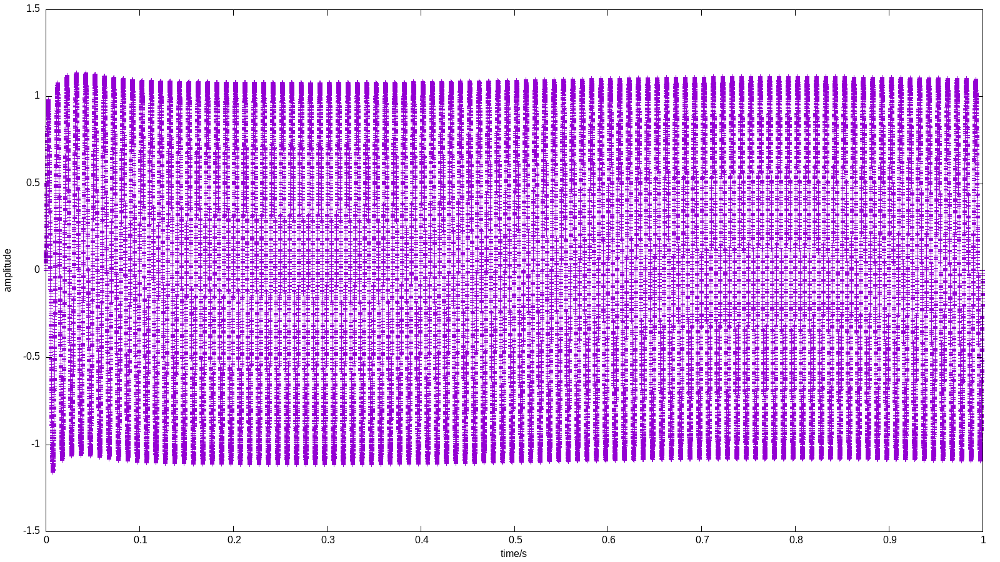
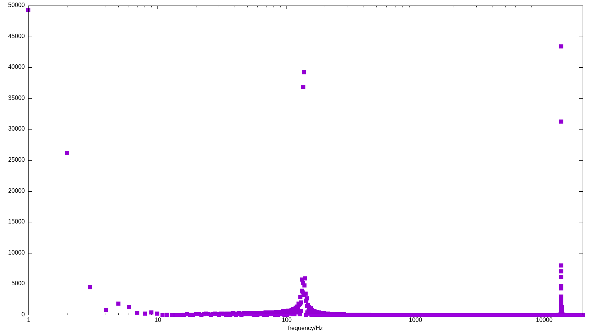
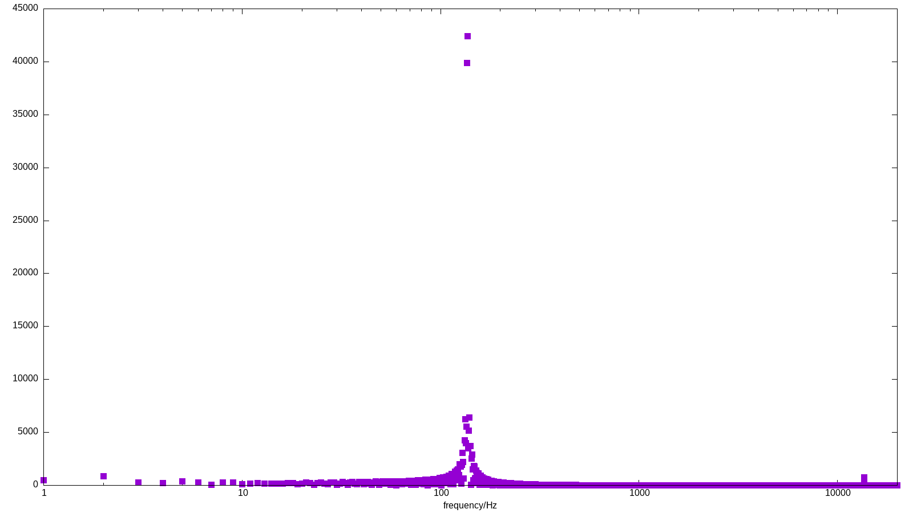
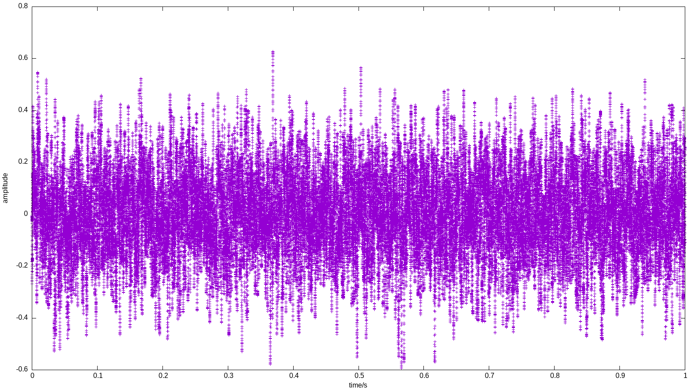

Testaufgabe Bandpassfilter
==========================

Aufgabe 1
---------
Siehe `Bandpass.java`.

Da `biz.source_code.dsp` schon alle Funktionalitäten bereitstellt, habe ich mich hier
dazu entschieden nur einen einfachen Wrapper zu schreiben.

Aufgabe 2
---------

siehe `main.java` bzw. `SignalGenerator.java`.

Ein sehr einfacher Signalgenerator mit mehreren Einschränkungen:
* nur Sinussignale mit ω = 0° (keine Phase)
* nur ganzzahlige Frequenzen möglich
* Signallänge bei überlagerten Signalen beträgt immer 1 Sekunde, 
    statt der kleinsten möglichen Hyperperiode.
    
#### a
> Wie lang sollte das Signal sinnvollerweise sein? 

Mindestens eine Hyperperiode (in diesem Fall eine Sekunde).

#### b
> Welche Mindestabtastrate wird für das Testsignal benötigt?

Nach dem Abtasttheorem von Shannon/Nyquist muss gelten:
> 2 * f_max < f_abtast

In diesem Fall ist f_max = 10kHz, also muss mit **mehr** als 20kHz abgetastet werden.

Aufgabe 3
---------

siehe `main.java`

Aufgabe 4
---------
 

Aufgabe 6
---------
 

